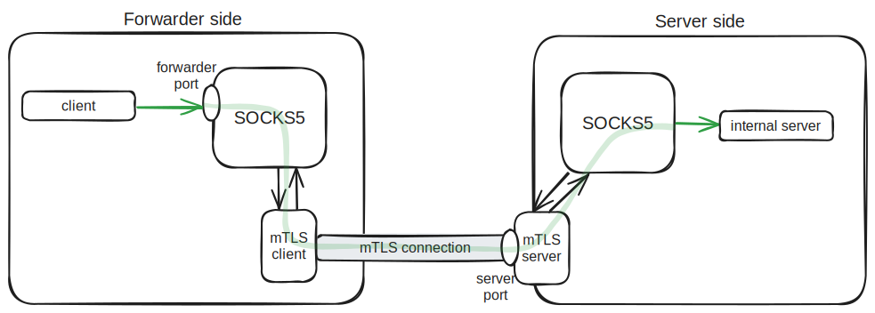

# mtlsocks5
Transparent SOCKS5 proxy implementation over mTLS



### TL;DR
```bash
# Serve SOCKS5 proxy over mTLS
mtlsocks5 server -l :1080
# Serve SOCKS5 proxy that forwards to the server
mtlsocks5 forwarder -l :1081 -s localhost:1080
# Test the proxy (forwarder socks5 -> mTLS client -> mTLS server -> server socks5 -> google.com)
curl --socks5-hostname localhost:1081 https://google.com
```


## Installation
### From releases
1. Download the binary from the [releases page](https://github.com/atorrescogollo/mtlsocks5/releases)
2. Make it executable
```bash
chmod +x mtlsocks5
```
3. Move it to a directory in your PATH (optional)
```bash
mv mtlsocks5 /usr/local/bin
```
4. Test the installation
```bash
mtlsocks5 --help
```

### From source
>NOTE: You need to have Go installed in your system. Check the version in the [go.mod](./go.mod#L3) file.
1. Clone the repository
```bash
git clone https://github.com/atorrescogollo/mtlsocks5.git
cd mtlsocks5
```
2. Build the binary
```bash
go build -o dist/mtlsocks5 .
```
3. Test the binary
```bash
./dist/mtlsocks5 --help
```

## Usage
1. Setup the certificates
```bash
mtlsocks5 mgmt new-ca
mtlsocks5 mgmt new-server -n localhost # The CN of the certificate

# Server certificate and key
ln -s localhost.crt certs/server.crt
ln -s localhost.key certs/server.key

# Forwarder certificate and key
ln -s localhost.crt certs/forwarder.crt
ln -s localhost.key certs/forwarder.key
```
```bash
$ tree certs/
certs/
├── ca.crt
├── ca.key
├── forwarder.crt -> localhost.crt
├── forwarder.key -> localhost.key
├── localhost.crt
├── localhost.key
├── server.crt -> localhost.crt
└── server.key -> localhost.key

0 directories, 8 files
```

2. Run the server
```bash
mtlsocks5 server -l :1080
```

3. Run the forwarder
```bash
mtlsocks5 forwarder -l :1081 -s localhost:1080 # Use same domain as in the certificate
```

4. Test the proxy
```bash
curl --socks5-hostname localhost:1081 https://google.com
```
